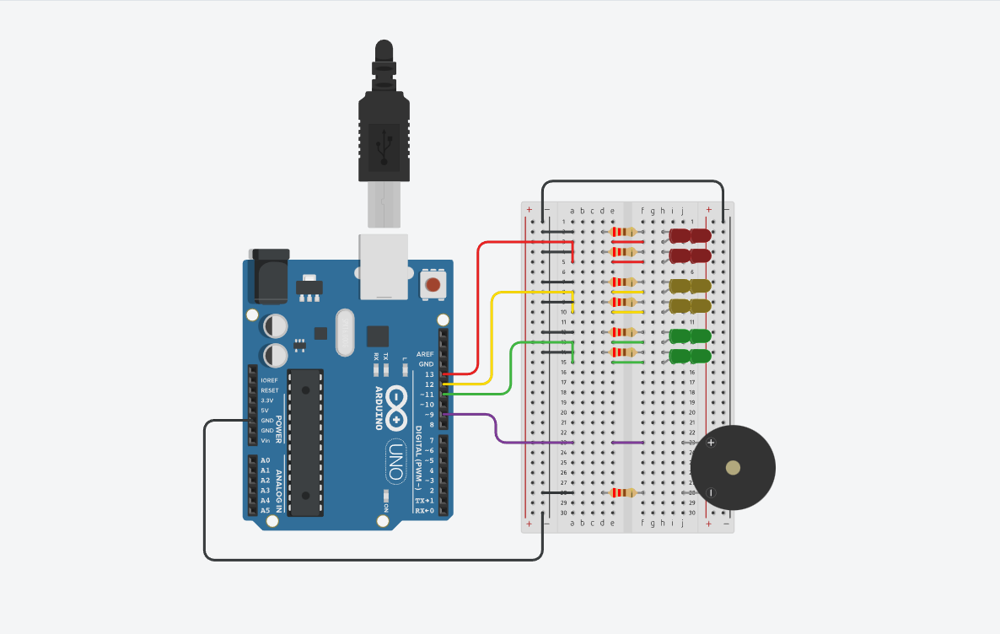

# Proyecto grupal Dojos 1 SPD 

## Integrantes 
 
 * Flores Brandon
 * Corimayo Alan
 * Falanga Alejandro
 * Fleitas Ezequiel
 * Yapura Franco

## Proyecto: Semáforo para no videntes	



### Descripción

El proyecto es un semaforo que incluye un buzzer para ayudar a las personas no videntes 

### Función principal

La función principal es que realiza un for primero con amarillo y verde en low y rojo en high sin delay para despues ponerselo a un buzzer y que se riga con el tiempo del buzzer.Y asi con el amarillo tambien.Para el verde solo un delay de high porque no usa el buzzer.

### Codigo 


```c++

void Semaforo()
{
  for(int i=0;i<30;i++)
  { 
    digitalWrite(led_rojo,1); 
    digitalWrite(led_amarillo,0); 
    digitalWrite(led_verde,0); 
    tone(Piezo,1000,500);
    delay(1000); 
  }
 for(int i=0;i<3;i++) 
  {
    digitalWrite(led_rojo,0); 
    digitalWrite(led_amarillo,1);
    tone(Piezo,100,50);
    delay(2000);
  }
  digitalWrite(led_amarillo,0); 
  digitalWrite(led_verde,1); 
  delay(45000); 
  for(int i=0;i<3;i++) 
  {
    digitalWrite(led_verde,0);
    digitalWrite(led_amarillo,1);
    tone(Piezo,100,50);
    delay(2000); 
  }
}

```

## Link al proyecto 

[tinkercard.com](https://www.tinkercad.com/things/37ccMppQhB1-1j-spd-ejercicio-dojos/editel?sharecode=3MVdRKb0hAKTQ7lR3MnpTVfMYtzgUW0z4c4jHSscBUM "Link al arduino")

### Fuentes 

[Consigna](https://classroom.google.com/c/NTUyNTQzNTI4MjMw/m/NjA1NDA2MDgzNzg4/details (Classroom))

[Tutorial de git](https://www.youtube.com/watch?v=oxaH9CFpeEE)

[Ejemplo de git](https://github.com/Estebamq/EjemploDocumentacion)

[Ayuda para el código del piezo](https://www.youtube.com/watch?v=xBLYrbYIxLA)
